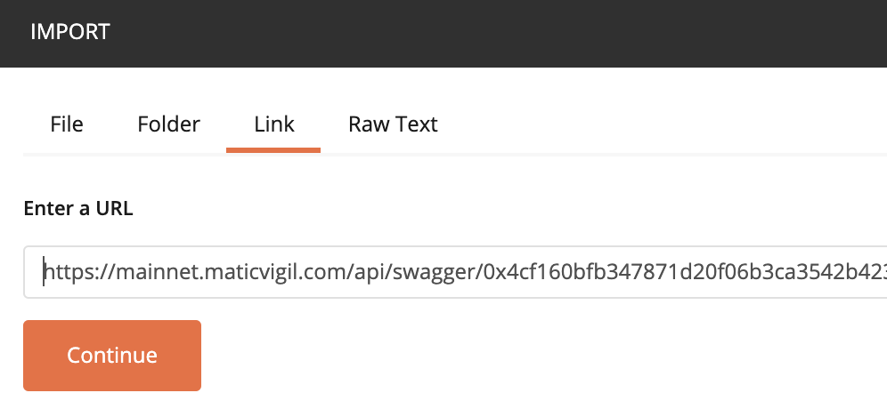
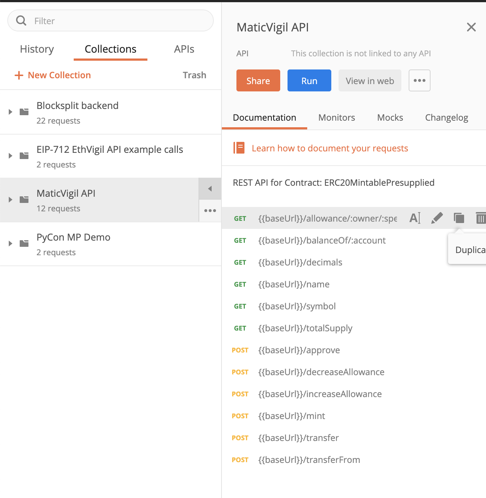
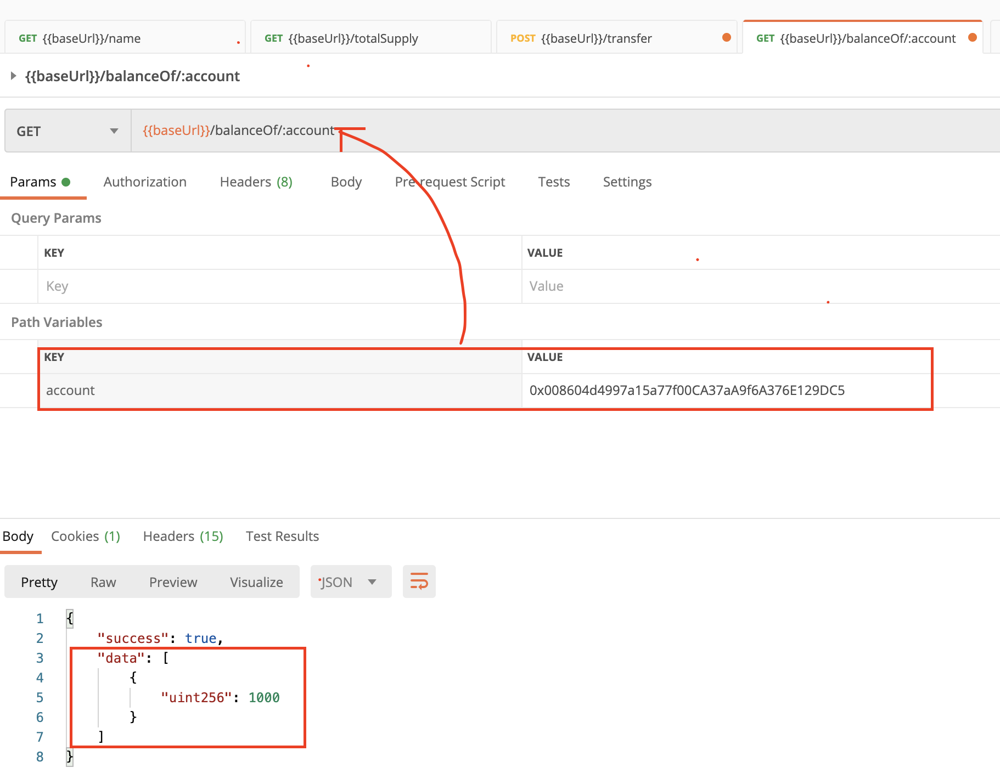

## Prerequisites
You are familiar with deploying contracts [via the CLI tool](cli_gettingstarted.md) or [the web frontend](web_gettingstarted.md).

## OpenAPI Specification
For every contract deployed or verified on MaticVigil, it automatically generates REST API endpoints over HTTPS which are available as an [OpenAPI Specification](https://swagger.io/specification/).

### Get the OpenAPI spec link
#### CLI
```
mv-cli getoas 0xbbd8cda5503e1df2983f738ad131a2304528e3dd

https://mainnet.maticvigil.com/api/swagger/0xbbd8cda5503e1df2983f738ad131a2304528e3dd/?key=80340b2a-633b-4a33-898c-06055ee10a34
```
The contract being used for this guide comes bundled with the CLI tool by the name [`ERC20MintablePresupplied.sol`](https://github.com/blockvigil/maticvigil-cli/blob/master/contracts/ERC20MintablePresupplied.sol) and implements the standard interface for an [ERC20 token contract](https://eips.ethereum.org/EIPS/eip-20). The modification introduced is where the Ethereum account that deploys the contract automatically gets a number of minted tokens, `1000000000000000000000000` to be exact.

> Ensure you copy over the included library [`SafeMath.sol`](https://github.com/blockvigil/maticvigil-cli/blob/master/contracts/SafeMath.sol) from the same directory.

#### Web UI

On visiting the contract's dashboard, you can find the OpenAPI spec link on the top left corner with a copy button and as well as right above the name of the contract.


## Import the OpenAPI spec in Postman

Click on the import button in the top left corner and select the `Link` tab.



You will see the Contract methods populated as HTTP GET and POST endpoints.



## GET HTTP endpoints

MaticVigil exposes the following as GET endpoints from the Solidity source code of a smart contract
* any `public` variable
* any `public` method that does not alter the state of the contract i.e. ***[`stateMutability` is `pure` or `view`](https://solidity.readthedocs.io/en/v0.5.10/abi-spec.html#json)***

Let us try out a couple of GET calls on the contract that reads the state data on chain.

### Get `name` of the ERC20 contract

**For example, against the public variable `name`**, MaticVigil automatically exposes it as a GET endpoint as if it were an accessor.


### Get `totalSupply` of this ERC20 contract


This tells us the total tokens in supply through this contract amounts to `1000000000000000000000000`.

## POST HTTP endpoints

MaticVigil exposes the following as POST endpoints from the Solidity source code of a smart contract

* any `public` method that alters the state of the contract i.e. ***[`stateMutability` is `payable` or `nonpayable`](https://solidity.readthedocs.io/en/v0.5.10/abi-spec.html#json)***

### Invoke `transfer()` method

**To perform POST calls on MaticVigil API, an HTTP header `X-API-KEY` is also expected. This holds the API key(Write) associated with your MaticVigil account**

The HTTP request headers are already populated with the necessary parameters, courtesy the tight integration between Postman and OpenAPI Specs. Ensure you put the API key(Write) associated with your account in the header field shown below.


**Once entering the necessary body and header request parameters, we complete the HTTP POST to `transfer()`**


It returns the transaction hash sent out on the blockchain network corresponding to this request, which is, `0x7692a2e847be499563bd3ed3fe95da1c9c37ccb2a90f31c884a2dce553a4102c`

### Verifying the state changes

We make a call to the public mapping `balanceOf` on the ERC20 smart contract that holds a mapping of Ethereum addresses to their allocated tokens. Enter the account address to which the transfer was made in the previous section against the path parameter in Postman.



As you can see, the transfer has resulted in the balance of `0x008604d4997a15a77f00CA37aA9f6A376E129DC5` to be set to `1000`, i.e. the value passed to the `transfer` method call.
